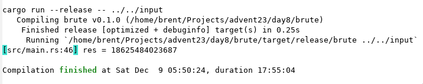

# Advent of Code 2023

I just finished reading the second edition of [The AWK Programming
Language](https://awk.dev/), so I'm going to do as many of this year's puzzles
as I can in awk. In addition to the solutions here, I'll be uploading daily
explanations to [my YouTube channel](https://www.youtube.com/@bwestbro).

## Day 1

I'm somewhat ashamed to admit this, but I got stuck for a while on part 2 and
needed a tip [from reddit][reddit1] to get unstuck. I don't want to spoil
anything here, but if you're getting the answer for the sample input but not
your puzzle input, you might need the hint given in this post. I don't feel that
bad about it because it's basically a clarification of the instructions, not a
programming hint.

## Day 2

Today felt much more approachable, just some straightforward string splitting
and a few regular expressions. Perfect for awk!

## Day 3

Conceptually not too bad, just watch out for those off-by-one errors! And
double-check the symbols that can be used...

## Day 4

Today actually felt like one of the early puzzles. Part 2 required a little bit
of interesting thought to do it in one pass, but the solution felt nice and
simple. That combination makes for a perfect puzzle.

## Day 5

Today was a conceptually simple puzzle, but the really naive solution for part 2
will use a colossal amount of memory. The slightly less naive solution uses a
constant amount of memory but requires a lot of CPU time. I spent much, much
longer than I'd like to admit trying to find the clever, efficient solution.
Finally, I gave up and translated my brute force algorithm from AWK to Rust and
had my second star in 2 minutes...

## Day 6

Easiest day so far. After yesterday I was getting quite nervous about part 2,
but the naive solution took only 5.51 seconds to run, and a small optimization
brings it down to 3.22 seconds, very reasonable.

## Day 7

I actually had a pretty easy time today, although I didn't try to do it all in
AWK. Combining two AWK passes with a run through `sort` made the whole thing
pretty straightforward. I used a trick I learned in The AWK Programming
Language: annotate your data with sort keys and pipe through `sort`. In this
case, the primary sort key is the hand type, followed by the cards themselves,
so I just printed numerical versions of each of those followed by any additional
data the second AWK pass needed and supplied six `-kN` flags to `sort`, where
`N` is the field number. If you happen to be using Python, I think its sort does
this automatically for tuples, so the whole challenge today is crafting the
right list of tuples.

The only other major insight I had was where to put the jokers to maximize the
score in part 2. At first I was afraid that this would be complicated and that
you might have to consider splitting the jokers or something. However, by
thinking through the case with 2 jokers, a pair, and a single card, I realized
that the jokers could just go on whichever other card type already has the most.
Splitting in this case would give a full house, compared to four of a kind.
Fortunately, that generalized to the whole sample and input files and got me my
two stars!

I was very surprised to see how high the leaderboard times were today, but I
guess this is the second-largest number of lines I've had to write (after day
5). The times also reflect this, with day 5 still being the longest so far.

## Day 8

I could blame [this post][reddit2] for spoiling me, but I think I went to reddit
looking for hints while waiting for my brute force version to run. At least my
optimization attempts made it easy to accommodate the mathematical solution. In
my "defense" the post was tagged "Funny" not "Spoiler," and I still had to
figure out how to apply the math concept it mentioned.

Update: my brute force solution finished after almost 18 hours, so now I can
claim not to have cheated too.

## Day 9

Today I just used Rust. I wrote a couple of lines of AWK and then realized that
the lack of real 2D arrays was going to be a real pain. It was pretty easy after
the switch, though.

[reddit1]: https://www.reddit.com/r/adventofcode/comments/1884fpl/2023_day_1for_those_who_stuck_on_part_2/
[reddit2]: https://www.reddit.com/r/adventofcode/comments/18dixqk/2023_day_8_part_2_come_to_papa_wait_a_minute/
